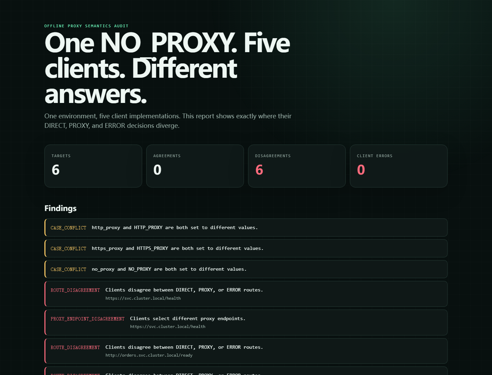
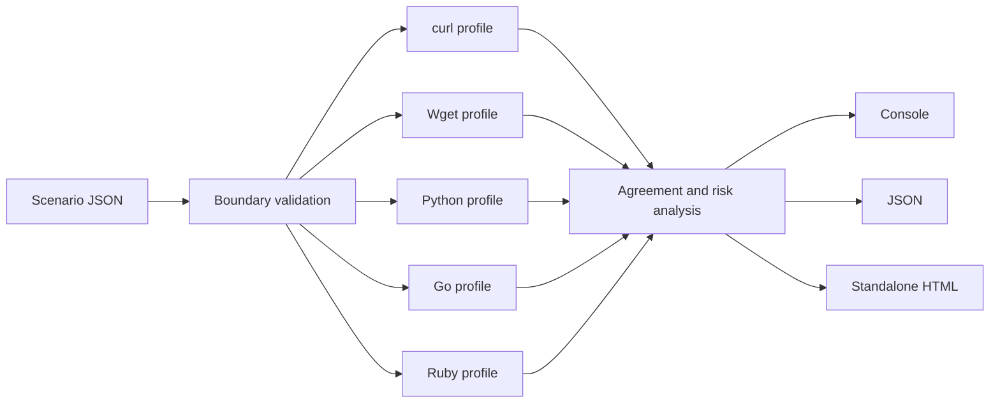

# ProxyParity

> One `NO_PROXY` string. Five clients. Different answers.

[](https://github.com/KanadeK/proxyparity/actions/workflows/ci.yml)
[](https://github.com/KanadeK/proxyparity/releases/latest)
[](https://nodejs.org/)
[](LICENSE)

[Live disagreement report](https://kanadek.github.io/proxyparity/) ·
[中文说明](README.zh-CN.md) ·
[Research](docs/RESEARCH.md) ·
[Troubleshooting](docs/TROUBLESHOOTING.md)

`NO_PROXY` is not standardized. curl, GNU Wget, Python `urllib`, Go
`net/http`, and Ruby `URI` can read the same environment and choose different
routes. ProxyParity models those source-grounded decisions offline, then emits
an explainable console matrix, stable JSON, and a standalone HTML incident
report.

It does not send a request, resolve DNS, or change your proxy settings.



## See the split in ten seconds

```console
$ git clone https://github.com/KanadeK/proxyparity.git
$ cd proxyparity
$ npm ci --ignore-scripts
$ node ./bin/proxyparity.mjs audit ./examples/split-brain.json --output-dir ./build/audit
ProxyParity
6 targets | 6 disagreements | 0 client errors

Target: https://svc.cluster.local/health [DISAGREE]
CLIENT     ROUTE    EVIDENCE
curl       DIRECT   no_proxy matched ".svc.cluster.local"
wget       PROXY    https_proxy -> http://lower.proxy.example:8080/
python     DIRECT   no_proxy matched ".svc.cluster.local"
go         PROXY    HTTPS_PROXY -> http://upper.proxy.example:8080/
ruby       DIRECT   no_proxy matched "10.0.0.0/8"
```

The command intentionally exits `2` because it found a valid disagreement. It
also writes `report.json` and `report.html`. Open the HTML file directly—there
are no scripts, CDNs, accounts, or servers behind it.

Use `--fail-on never` when you want a report without a non-zero finding exit.

## Install a release

Download `proxyparity-0.1.0.tgz` from the
[latest GitHub Release](https://github.com/KanadeK/proxyparity/releases/latest),
then install it with npm:

```console
npm install --global ./proxyparity-0.1.0.tgz
proxyparity --version
proxyparity audit ./scenario.json
```

ProxyParity is packaged as a zero-runtime-dependency Node.js CLI and library.
It is distributed through GitHub Releases; v0.1.0 is not published to the npm
registry.

## What it catches

- Conflicting lowercase and uppercase proxy variables.
- `HTTP_PROXY` being ignored, preferred, warned about, or rejected in CGI.
- A leading dot matching a root domain in some clients but not others.
- `*` disabling proxies in only part of a mixed-language stack.
- CIDR rules applying to literal IPs, Ruby's DNS result, both, or neither.
- Optional port rules changing only some clients' decisions.
- Go and Ruby bypassing loopback while other clients use the proxy.
- Clients agreeing on `PROXY` but selecting different proxy endpoints.

## Supported behavior matrix

| Behavior | curl | Wget | Python | Go | Ruby |
| --- | --- | --- | --- | --- | --- |
| HTTP uppercase proxy | ignored | ignored | outside CGI | preferred | outside CGI, discouraged |
| Uppercase `NO_PROXY` | yes | no | yes | preferred | fallback |
| Leading dot matches root | yes | no | yes | no | no |
| `*` matches all | yes | no | only as the sole value | yes | no |
| CIDR | literal IP | no | no | literal IP | first resolved IP |
| Optional port rules | no | no | yes | yes | yes |
| Automatic loopback bypass | no | no | no | yes | after resolution |

These are explicit compatibility profiles, not a new universal standard. See
[the research record](docs/RESEARCH.md) for upstream sources and scope.

## Scenario format

```json
{
  "schemaVersion": 1,
  "environment": {
    "http_proxy": "http://lower.proxy.example:8080",
    "HTTP_PROXY": "http://upper.proxy.example:8080",
    "no_proxy": ".svc.cluster.local,10.0.0.0/8",
    "NO_PROXY": "*.corp.example"
  },
  "targets": [
    {
      "url": "https://api.svc.cluster.local/health",
      "resolvedIps": ["10.42.7.18"]
    }
  ]
}
```

Only proxy-related keys are accepted, so accidentally pasting a full process
environment fails fast. `resolvedIps` is ordered; Ruby uses the first address to
model `IPSocket.getaddress` without performing a live DNS lookup. Target URLs
with credentials are rejected. Proxy URL credentials are redacted from every
output.

The complete contract is in [docs/SPEC.md](docs/SPEC.md).

## CLI

```text
proxyparity audit <scenario.json> [options]
proxyparity profiles [--json]
proxyparity --version

--format <console|json>
--output-dir <directory>
--fail-on <disagreement|never>
```

Exit codes:

- `0`: valid scenario with agreement, or `--fail-on never`.
- `1`: invalid JSON/schema, unsupported CLI usage, or I/O failure.
- `2`: valid scenario with at least one cross-client disagreement.

## How it works



All evaluators are pure and deterministic. Shared code handles mechanical IP,
CIDR, port, and output safety; client-specific precedence and matching branches
remain explicit.

## Library API

```js
import { analyzeScenario, renderHtml } from "proxyparity";

const report = analyzeScenario(scenario);
const html = renderHtml(report, { title: "Staging proxy audit" });
```

## Develop and verify

```console
npm ci --ignore-scripts
npm test
npm run check
```

`npm run check` runs the full test suite with coverage, syntax checks every
module, builds the demo, packs the npm tarball, installs it into a fresh
temporary project, and exercises both the agreeing and disagreeing fixtures
through the installed CLI.

If a command fails, follow the concrete repair path in
[docs/TROUBLESHOOTING.md](docs/TROUBLESHOOTING.md). Contributions that change a
profile must include a primary-source link and a focused conformance test.

## Security and privacy

ProxyParity is deliberately offline. It never imports the current environment,
contacts a target, resolves a hostname, or modifies system settings. Reports do
not contain the input environment and redact proxy userinfo. See
[SECURITY.md](SECURITY.md) for the reporting policy.

## License

[MIT](LICENSE)
